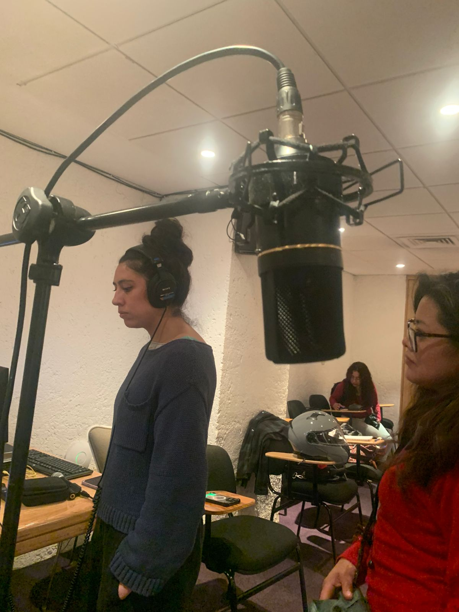
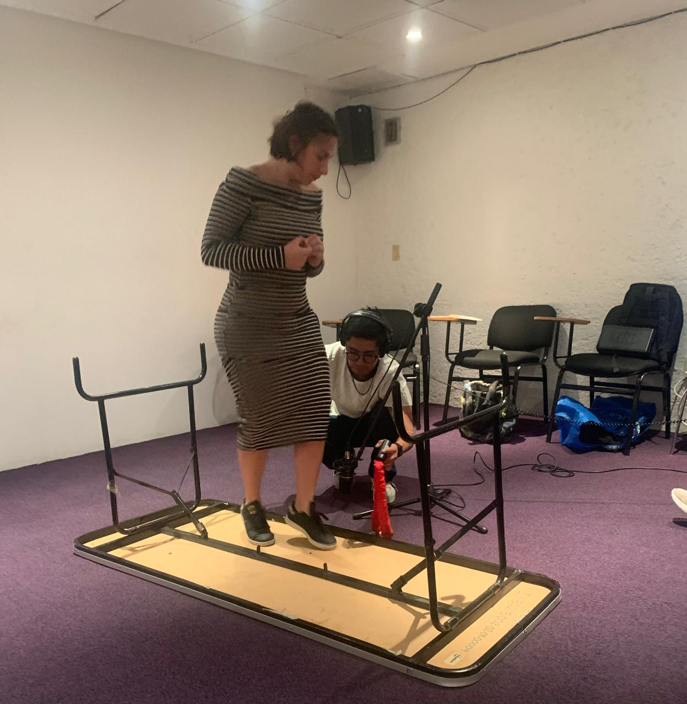
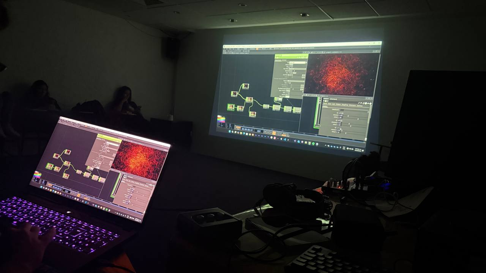

# **Sesión 4: Coreografiando la Agencia Sonora - El Sonido como Personaje Escénico**

**Objetivo General:**
Profundizar en la espacialización sonora, aprendida en la sesión 3, para coreografiar piezas donde el sonido—amplificado a través de prótesis—actúe como un **agente escénico autónomo** que construye y modifica dramáticamente el espacio y la relación con los cuerpos.

**Pregunta Detonadora:**
Si el sonido es un personaje, tanto en la obra de Beckett como en las suyas, **¿qué tipo de personaje sería? ¿Un dictador, un seductor, un guía, un antagonista?** ¿Cómo coreografiamos la relación entre los cuerpos y un espacio sonoro que tiene agencia propia?

**Objetivos de la Sesión:**
*   **Conceptual:** Comprender la espacialización sonora como un elemento fundamental para construir una arquitectura acústica que altere la percepción del espacio escénico.
*   **Práctico:** Dominar el uso de herramientas técnicas (micrófonos, grabación) para transformar un sistema de sonido en un instrumento de escenografía activa.
*   **Escénico:** Desarrollar una escucha espacial aguda y aprender a *dramaturgizar* el espacio acústico.
*   **Compositivo:** Crear una pieza sonora *site-specific* de 1 minuto que aplique el principio de economía beckettiana y utilice la espacialización como su principal recurso.

---

## **Bitácora de la Sesión: Del Texto a la Agencia Sonora**

### **Bienvenida y Recapitulación**
La sesión comenzó con un **check-in** en el que cada alumno compartió una palabra que definiera su experiencia trabajando con el espacio sonoro de manera precisa y económica, al estilo Beckett. Palabras como "minimalismo", "tensión" y "inmersivo" flotaron en el aire, marcando el tono para una jornada de profundización.

### **Calentamiento: Sintonizando el Cuerpo-Espacio**
Realizamos una activación enfocada en la respiración y la imaginación de extensiones corporales, preparándonos para pensar nuestros cuerpos como interfaces que se relacionan entre ellos.

### **Audición Dramatúrgica: La Lectura como Plano Sonoro**
En el **reagrupamiento por equipos**, llevamos a cabo una **"Audición Dramatúrgica"**. Cada equipo leyó su partitura/texto dos veces. La primera fue una lectura fluida; la segunda, una lectura lenta y analítica, guiada por preguntas detonadoras que nos obligaron a escuchar con precisión de arquitectos acústicos:
*   ¿De dónde viene el sonido? ¿Se mueve?
*   ¿Cuál es el papel de los silencios? ¿Añaden pausa, tensión, vacío, respiro?
*   ¿El sonido sugiere un gesto, una reacción, una emoción?
*   ¿Cuál es el tema central de la pieza? ¿Soledad, vigilancia, memoria?

Este ejercicio transformó la lectura pasiva en una decodificación colectiva de la arquitectura de cada pieza.

### **Laboratorio de Agencias: Montaje y Presentación**
Después de un receso comenzamos con el **montaje y presentación** de las obras. La dinámica fue un **"Laboratorio de Agencias"**, donde cada presentación fue un experimento sobre la relación de poder entre los sonidos y la dramaturgia en tres actos.
*   Cada equipo tuvo un tiempo ágil para montaje y presentación.

### 🎥 Registro de la Sesión: Archivos Multimedia

### Equipo 1
**Crujido**

<video controls style="position: absolute; top: 0; left: 0; width: 100%; height: 100%;">
  <source src="../assets/video/sesion4.mp4" type="video/mp4">
</video>

<audio controls style="width: 100%; margin: 0.5rem 0;">
  <source src="../assets/audio/sesion4/crujido2.wav" type="audio/mpeg">
  Tu navegador no soporta el elemento audio.
</audio>

### Equipo 2
**Estrés y calma**

<audio controls style="width: 100%; margin: 0.5rem 0;">
  <source src="../assets/audio/sesion4/estrescalam2.wav" type="audio/mpeg">
  Tu navegador no soporta el elemento audio.
</audio>

### Equipo 3
**Emergencia**

<audio controls style="width: 100%; margin: 0.5rem 0;">
  <source src="../assets/audio/sesion4/emergencia.wav" type="audio/mpeg">
  Tu navegador no soporta el elemento audio.
</audio>

### Equipo 4
**Ruptura**

<audio controls style="width: 100%; margin: 0.5rem 0;">
  <source src="../assets/audio/sesion4/ruptura2-sinruido.wav" type="audio/mpeg">
  Tu navegador no soporta el elemento audio.
</audio>

### Equipo 5
**Tormenta**

<audio controls style="width: 100%; margin: 0.5rem 0;">
  <source src="../assets/audio/sesion4/tormenta.wav" type="audio/mpeg">
  Tu navegador no soporta el elemento audio.
</audio>

### Proceso de trabajo

  

    
  

  

    
  

  

    
  

### **Cierre y Reflexión: El Sonido como Coreógrafo**
Al finalizar el montaje realizarmos la escucha de las piezas y la realización de otras en vivo. Con ello realizamos un **cierre reflexivo** con preguntas que buscaban conectar la práctica con la teoría:

**Sobre la Materialización del Plano:**
*   ¿Qué relación vieron entre lo planeado y lo que hicieron?
*   ¿Qué detectaron en la partitura que se materializó de manera especialmente poderosa? ¿Hubo desviaciones o sorpresas?

**Sobre la Agencia y la Dramaturgia:**
*   **¿Quién llevaba la batuta?** Durante la pieza, ¿quién sentían que 'llevaba la batuta'? ¿El sonido, la imagen, o era una negociación?
*   **El sonido como personaje:** ¿Qué tipo de mundo o realidad (cosmotécnica) construyó esta pieza a través del sonido? ¿Fue un mundo opresivo, onírico, íntimo?
*   **El momento del evento:** ¿En qué momento el sonido dejó de ser fondo y se convirtió en un **evento** que modificó su percepción?
*   **La pregunta clave:** Si Beckett buscaba control absoluto, **¿dónde vieron que la tecnología (el sonido) mostró su propia 'agencia' o voluntad?**

## **Referencias Artísticas: Coreografiando lo Humano y lo No-Humano**

Para ampliar nuestro horizonte y conectar nuestra investigación con la escena contemporánea, exploramos dos referencias clave que dialogan directamente con nuestra pregunta detonadora:

1.  **Joana Chicau - *[Choreographing the Machine](https://re-coding.technology/choreographing-you/)*:** Esta plataforma reúne obras de artistas que negocian con la agencia de sistemas automatizados y tecnológicos. Nos muestra cómo la coreografía surge de la relación con lo no-humano, donde el artista no impone un movimiento, sino que establece un conjunto de reglas para una colaboración creativa entre el cuerpo y la máquina.

2.  **Miguel Rodríguez Sepúlveda - *[Concierto para tres machetes](https://www.miguelrodriguezsepulveda.com/concierto-para-tres-machetes)*:** Esta pieza es un ejemplo extraordinario de cómo un objeto cotidiano y cargado de significados (el machete) puede ser transformado en una **prótesis sonora y coreográfica**. Al ser activado y amplificado, el machete deja de ser un simple instrumento para convertirse en un **personaje escénico** con una potente agencia sonora. Su sonido metálico, resonante y potencialmente violento, coreografía la acción de los intérpretes y construye una atmósfera dramática tensa y ritualística. Esta obra materializa perfectamente la idea de que la prótesis tecnológica no solo amplifica sonidos, sino que amplifica **historias, gestos y relaciones de poder** en el espacio.

<iframe 
  width="100%" 
  height="400" 
  src="https://www.youtube.com/embed/R7ziJ2ov3WA" 
  frameborder="0" 
  allow="accelerometer; autoplay; clipboard-write; encrypted-media; gyroscope; picture-in-picture" 
  allowfullscreen
  style="margin: 2rem 0;">
</iframe>

---

**Reflexión Final:**
Esta sesión nos permitió dar un salto conceptual crucial: **el sonido ya no es escenografía, es un coreógrafo**. Aprendimos que espacializar el sonido no es solo un acto técnico, sino un acto dramático y político que define relaciones de poder, crea mundos y, en última instancia, nos convierte en cyborgs en diálogo constante con la tecnología que amplifica y transforma nuestra presencia.

**Tarea siguiente sesión**
Traer por persona al menos uno de los siguientes materiales.  
- Papel aluminio  
- Plástico de burbujas (largo)  
- Bolsas de plástico  
- Cinta Adhesiva Canela o Transparente  
- Papel Kraft o Cartulina   
o cualquier otro material que suene con el movimiento del cuerpo  
