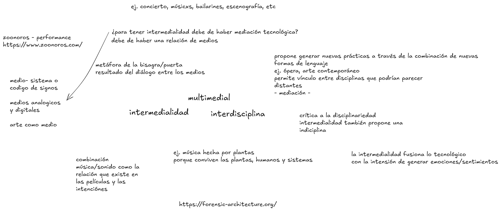
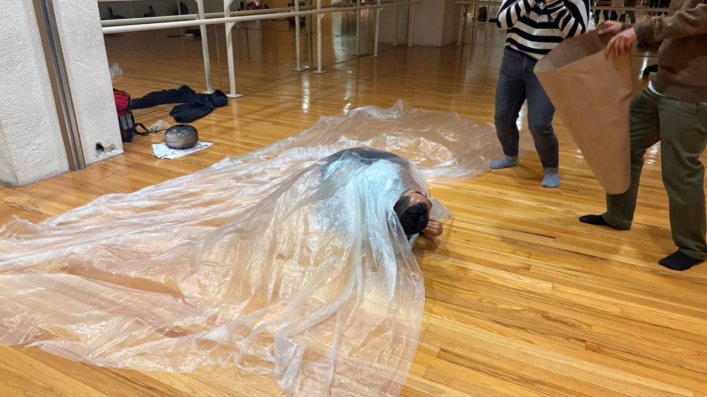
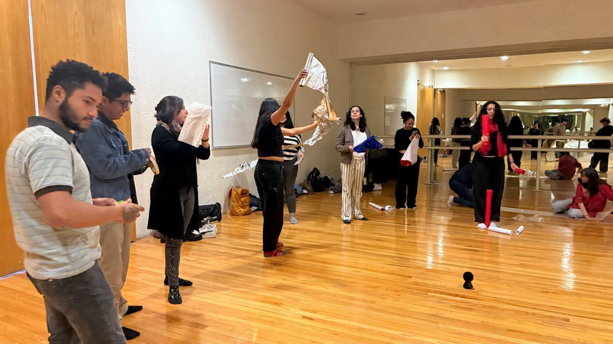

# Sesión 5: Intermedialidad como Bisagra - Teoría y Práctica en Diálogo

## Calentamiento: Meditación Sónica

Comenzamos la sesión con una **meditación sónica** que nos permitió sintonizar cuerpo y escucha, preparando nuestros sentidos para la exploración intermedial que seguiría. Un ejercicio de presencia auditiva que nos conectó con la materialidad del sonido y su capacidad para modificar nuestra percepción del espacio-tiempo.

## Revisión de la Sesión Anterior

Retomamos los ejercicios de espacialización sonora beckettiana, reflexionando colectivamente sobre las preguntas que guiaron nuestra práctica:

**¿Qué relación emergió entre lo planeado y lo ejecutado?** 
**¿Qué medios entraron en diálogo en sus puestas en escena?**
**¿Dónde percibieron que la tecnología mostró su propia agencia?**

Las respuestas revelaron negociaciones entre el control compositivo y la autonomía del sonido, evidenciando cómo las prótesis tecnológicas pueden convertirse en co-creadoras de la dramaturgia.

## Discusión Teórica: Intermedialidad como Territorio de Confluencias

Profundizamos en las lecturas de **Ruth Cubillo Paniagua** y **María Andrea Giovine Yáñez**, construyendo colectivamente un mapa conceptual que articula sus principales aportaciones:

### Hallazgos Colectivos

**Giovine** nos presenta la intermedialidad como **bisagra** entre teoría y práctica, un territorio de confluencias mediales donde las obras se convierten en "ecosistemas mediales". Su concepto del **artista-investigador** resonó profundamente con nuestra metodología de trabajo.

**Cubillo**, por su parte, enfatiza la intermedialidad como espacio de diálogo entre prácticas significantes y medios tecnológicos, destacando las categorías de **transposición medial, combinación de medios y referencialidad intermedial**.

Algunas ideas retomadas durante la sesión

Este mapa conceptual sintetiza los principales conceptos discutidos en la sesión, mostrando cómo la intermedialidad articula teoría y práctica, ecosistemas mediales y el diálogo con la tecnología.

[Ver el mapa conceptual en Excalidraw](https://excalidraw.com/#json=XF9m-NluWiTXCU6bUt-J-,lp_AvaFyfoYVS2-PcS8Ujw)

## Referente Artístico: 

**Miguel Rodríguez Sepúlveda - [Concierto para Tres Machetes](https://www.miguelrodriguezsepulveda.com/concierto-para-tres-machetes)** 
Analizamos la pieza de como ejemplo paradigmático de intermedialidad, donde el machete trasciende su función utilitaria para convertirse en prótesis sonora, instrumento musical y elemento coreográfico simultáneamente.

**Joana Chicau - [Choreographing the Machine](https://re-coding.technology/choreographing-you/)**: Esta plataforma reúne obras de artistas que negocian con la agencia de sistemas automatizados y tecnológicos. Nos muestra cómo la coreografía surge de la relación con lo no-humano, donde el artista no impone un movimiento, sino que establece un conjunto de reglas para una colaboración creativa entre el cuerpo y la máquina.

Algunos otros ejemplos de piezas y proyectos: 
- [Zoonoros. Laboratorio de Precariedad de inter(in)disciplina](https://www.zoonoros.com/)
- [Forensis architecture](https://muac.unam.mx/exposicion/forensic-architecture)

## Ejercicio Práctico: Concierto Cuerpo-Objeto

La teoría se materializó en un ejercicio de performatividad sonora donde exploramos la relación cuerpo-objeto mediante materiales cotidianos:

- **Papel aluminio** 
- **Plástico de burbujas** 
- **Bolsas de plástico** 
- **Masking tape** 

Las cuales fungieron como extensión metálica de la piel, paisaje táctil-sonoro, membranas respiratorias, conector corporal.

Cada participante se presentó mediante un **gesto sonorizado**,  cómo la materialidad del objeto transforma la cualidad del movimiento/sonido y viceversa.

## Demostración Tecnológica: Makey Makey como Interface Cyborg

Experimentamos con **Makey Makey** como sistema de interfaz corporal, descubriendo cómo cualquier material conductor puede convertirse en extensión sensible del cuerpo. Esta demostración abrió posibilidades para la próxima sesión, donde integraremos estos principios en composiciones cartográficas colectivas.

Algunos ejemplos de interfaces con Makey Makey: 

<iframe src="https://player.vimeo.com/video/279920496?badge=0&amp;autopause=0&amp;player_id=0&amp;app_id=58479" frameborder="0" allow="autoplay; fullscreen; picture-in-picture; clipboard-write; encrypted-media; web-share" referrerpolicy="strict-origin-when-cross-origin" style="position:absolute;top:0;left:0;width:100%;height:100%;" title="MaKey MaKey - An Invention Kit for Everyone"></iframe>

Para programar la makey makey pueden usar [Scratch](https://scratch.mit.edu/projects/editor/?tutorial=getStarted) o [Pure Data](https://puredata.info/) aunque para este ejercicio usaremos Scratch.

## Reflexión Final: Intermedialidad como Metodología Viva

Esta sesión revisamos la **intermedialidad como metodología** más que una simple técnica. Comprendimos que no se trata de "usar" medios, sino de investigar cómo los medios se relacionan, chocan y crean nuevos sentidos. La bisagra teoría-práctica giró fluidamente, demostrando que el marco conceptual no es un apéndice, sino el tejido conectivo que da profundidad a nuestra investigación creativa.

**La intermedialidad nos exige ser artistas-investigadores, cartógrafos de territorios sensibles donde el cuerpo, la tecnología y el sonido negocian constantemente sus agencias.**

## Tareas y Proyecciones

### Para la Próxima Sesión:
- **Concierto a tres cuerpos** Comenzaremos la sesión con un ejercicio en donde por equipos de tres personas realizaremos un concierto a tres cuerpos retomando los objetos sonoros explorados en la sesion pasada.   
Posteriormente pasaremos a experimentar con interfaces conductivas utilizando Makey Makey y materiales cotidianos partiendo de la idea de realizar una cartografía sonora del espacio habitado en colectivo.   Para ello es importante que traigan los siguientes materiales:   
- **Traer materiales conductores** (aluminio, cinta conductiva)
- **Cartografiar sonoramente los espacios habitados** - recolectar por persona de 2 a 5 sonidos que evoquen estos espacios, pueden ser grabados, encontrados en línea o sintetizados. Subir los archivos a esta carpeta compartida: [Enlace a carpeta](https://drive.google.com/drive/folders/1BBBzlT-s1yLapiIgbitRCntYrhYxyo1-?usp=sharing)   
NOTA: Crear una carpeta con tu nombre y subir los archivos ahí.
- **Reflexionar sobre las sensaciones corporales** asociadas a estos sonidos (solo reflexión no traer nada escrito).

---

*Próximo encuentro: Ampliando las fronteras del cuerpo sonoro mediante interfaces conductivas y cartografías auditivas del espacio habitado.*