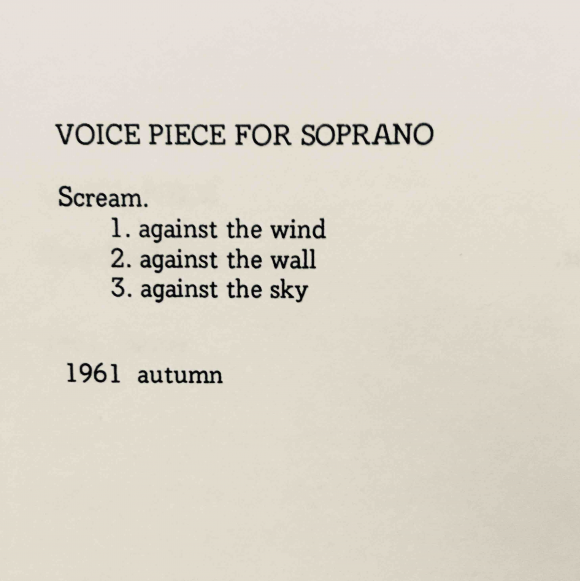

# Sesión 6: Cartografías Sonoras Cyborg - Del Cuerpo Conductor al Territorio Sensible

## Calentamiento

Iniciamos con una activación sonora sensorial escuchando y sientiendo las resonancias de nuestros cuerpos y de los demás. 

## Revisión del Concierto a Cuatro Cuerpos

Retomamos el ejercicio de la sesión anterior ampliándolo a **cuartetos corporales**, donde los objetos sonoros explorados se encontraron en diálogo, fricción y resonancia:

**¿Cómo negociaron las agencias sonoras de cada objeto en el conjunto?**
**¿Qué nuevas texturas acústicas emergieron de la combinación?**
**¿Dónde percibieron que el cuarteto generó una identidad sonora propia?**

Las respuestas revelaron cómo la performatidad colectiva transforma los materiales individuales en ecosistemas sonoros relacionales y compartimos los hallazgos encontrados.

## Referentes Artísticos: Cartografías del Cuerpo Extendido

**[Teri Rueb - "Drift"](https://terirueb.net/drift-2004/)**: Analizamos esta instalación de paisaje sonoro activado por GPS como antecedente de nuestra cartografía, donde el recorrido corporal construye narrativa sonora.

    <iframe src="https://player.vimeo.com/video/47798251?h=f49e66995c" 
            frameborder="0" 
            allow="autoplay; fullscreen; picture-in-picture" 
            style="position:absolute;top:0;left:0;width:100%;height:100%;"
            title="Vimeo video player">
    </iframe>

  

**[Yoko Ono - "Pieza de voz para soprano"](https://historia-arte.com/obras/pieza-de-voz-para-soprano)** (1961): Esta instrucción de la artista conceptual japonesa forma parte de su libro Grapefruit y consiste simplemente en la frase: "Scream". Ono propone al cuerpo como instrumento cartográfico primario, donde los mapas se trazan no en el espacio exterior sino en el territorio interno de la respiración, los pulmones y la laringe. Esta obra seminal del arte conceptual y la performance conecta directamente con nuestra exploración de cartografías sensibles, recordándonos que el primer instrumento de medición es nuestro propio cuerpo respirante, y que todo mapeo sonoro comienza con el grito como acto fundamental.

## Ejercicio. Hacia la Cartografía Sonora 

Para comenzar con el ejercicio de cartografías sonora comenzamos escuchando los sonidos de los espacios habitados que cada participante trajo.

La teoría se materializó en un laboratorio de prototipado donde exploramos las posibilidades del Makey Makey como extensión cyborg:

La idea es retomar las ideas de **Haraway** para conectar co nuestra propia condición cyborg: al conectar nuestros cuerpos al Makey Makey, nos convertimos en **híbridos temporales** de carne y circuito, practicando el **"hacer parentesco"** con la tecnología. Partimos de los **"saberes situados"** como escucha para resonar  cada recorrido cartográfico que generemos como sonido encarnado.

### Materiales Explorados
- **Superficies conductoras:** Cables, cinta conductiva.

Colectivamente diseñaremos un **prototipo de zona cartográfica**, experimentando con:
- La relación entre **gesto corporal** y **respuesta sonora**
- La **escala del contacto** (toque suave vs. presión firme)
- El **ritmo de la interacción** (activación puntual, sonido sostenido, repetición rítmica)

A partir del prototipo colectivo, comenzamos a tejer una **cartografía** del espacio del aula trabajando por grupos:

### Proceso de Mapeo

Para este ejercicio, que completaremos en la sesión 7, cada grupo diseñará una acción performática integrando:

1. **Geolocalización sonora:** Asignaremos zonas del espacio a los sonidos recolectados de los espacios habitados
2. **Diseño de recorridos:** Estableceremos posibles rutas de deriva entre los puntos sonoros
3. **Escritura de scores:** Desarrollaremos partituras corporales para guiar la exploración a partir de instrucciones simples que conecten gesto, sonido y espacio, similar los **event scores** (partitura de acciones simples) de la performance de Yoko Ono.

## Balance de mitad de curso. 

En este momento del diplomado realizamos un balance colectivo. En el cual llegamos a las siguientes acuerdos:

- La necesidad de profundizar en la exploración corporal y sonora.
- Dedicar más tiempo al inicio de cada sesión para calentamientos, ejercicios corporales y ejercicios de escucha activa.
- Incorporar reflexiones sinestéticas corporales y su agencia en la creación artística.
- Fomentar la colaboración y el diálogo entre los participantes.
- Incluir un espacio de seminario para compartir procesos, proyectos y referencias por estudiantes para presentar avances y recibir retroalimentación.
- La ultima sesión se dedicará a la presentación de proyectos finales.

## Actividades para la próxima sesión
- Completar el prototipo de cartografía sonora en grupo.
- Preparar una breve presentación de algún proceso o proyecto personal relacionado con los temas del curso.

---
**[← Sesión 5](./sesion5.md)** | **[Sesión 7 →](./sesion7.md)**

---