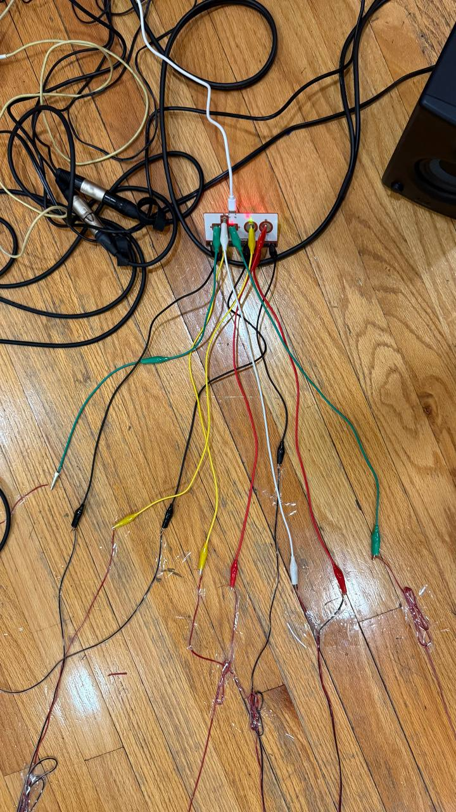
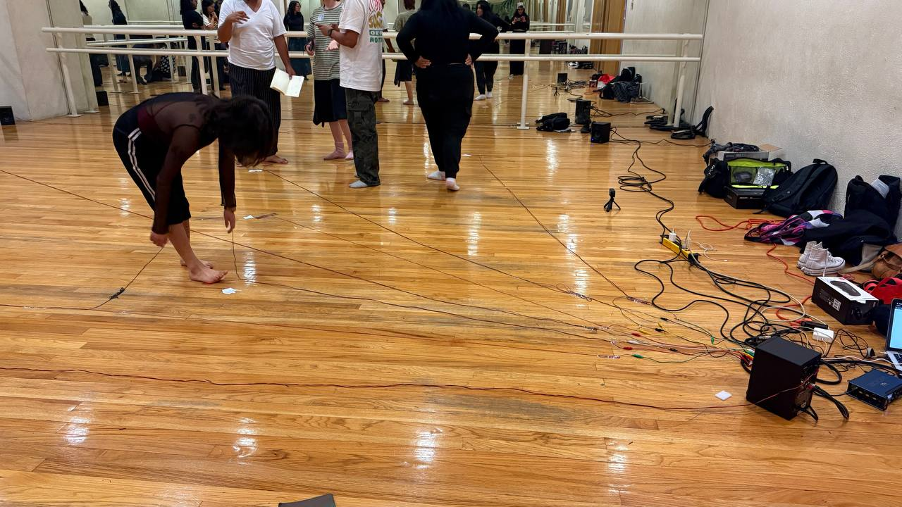

# Sesión 7: Vocabulario Sonoro Corporal - Del Gesto Aislado al Cardumen Sonoro

## 1. Calentamiento: Sintonizando el Cuerpo Resonante

Iniciamos la sesión sumergiéndonos en la escucha interna a través de tres ejercicios de sintonización corporal:

### Respiración Vibratoria
En posición cómoda, con ojos cerrados y rodillas flexionadas, comenzamos con un "mmmm" grave y constante que generó movimiento espontáneo. La columna se convirtió en antena resonante, arqueándose y girando impulsada por la vibración sonora. **El sonido ya no acompañaba al movimiento, lo generaba.**. 

### Lanzamiento de Sonido-Gesto
Exploramos la fusión indivisible entre acción vocal y movimiento:
- Sonidos que se deslizan por brazos extendidos
- Girófonos que emergen de caderas en espiral
- Saltos sónicos que impulsan desde los pies 

## 2. Vocabulario Colectivo: Del Gesto Individual al Cardumen

Desarrollamos un léxico corporal compartido a través de movimientos sonoro-gestuales como archivo corporal vivo.
Utilizando grabadoras como extensiones tecnológicas de la memoria, documentamos nuestro vocabulario recién creado.

<audio controls style="width: 100%; background: #f0f0f0; border-radius: 8px;">
    <source src="../assets/audio/sesion6-01.mp3" type="audio/mpeg">
    Tu navegador no soporta el audio.
</audio>

<audio controls style="width: 100%; background: #f0f0f0; border-radius: 8px;">
    <source src="../assets/audio/sesion6-02.mp3" type="audio/mpeg">
    Tu navegador no soporta el audio.
</audio>

## 3. Montaje de la Cartografía: Del Ejercicio a la Instalación

Retomamos el trabajo con la cartografía sensible, realizamos el montaje técnicos y organizamos los espacios de interacción:
- **Distribución del Makey Makey** y conexiones
- **Zonas de interacción** definidas por cada grupo
- **Pruebas de sonido** y ajustes técnicos
- **Planeación de la acción performática** entre segmentos cartográficos

### Ejecución de Piezas por equipos
Cada equipo presentó su segmento cartográfico, aplicando relación gesto-sonido diseñada.

<video width="100%" controls>
  <source src="../assets/video/sesion6-equipo1.mp4" type="video/mp4">
  Tu navegador no soporta el elemento video.
</video>

<video width="100%" controls>
  <source src="../assets/video/sesion6-equipo2.mp4" type="video/mp4">
  Tu navegador no soporta el elemento video.
</video>

<video width="100%" controls>
  <source src="../assets/video/sesion6-equipo3.mp4" type="video/mp4">
  Tu navegador no soporta el elemento video.
</video>

## 4. Reflexión Final: Hacia la Performance Colectiva

Esta sesión marcó el punto donde la técnica individual se transforma en lenguaje colectivo. Comprobamos que:

**El vocabulario corporal compartido no homogeniza, sino que potencia la singularidad** al proporcionar un terreno común para el diálogo improvisatorio.

**La cartografía sonora dejó de ser un circuito electrónico para convertirse en un sistema nervioso colectivo**, donde cada gesto individual afecta al organismo completo.

El cardumen nos enseñó que la coordinación no requiere de un director, sino de **atención radical al presente sonoro que co-creamos**.

---

## Próximos Pasos

### Tarea::
- **Traer material u objetos para compartir** e iniciar la exploración y planeación de los proyectos finales.  

---

**[← Sesión 6](./sesion6.md)** 

---